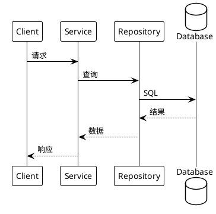

# [AR编号] Design 增量设计

> 本文档描述对 DESIGN.md 的增量变更。
> 完成后需合并到全量 DESIGN.md 中。

---

## 1. 设计背景

### 1.1 设计目标

[描述本次设计要实现的技术目标]

### 1.2 设计约束

1. [约束1]
2. [约束2]

### 1.3 非目标

- [明确不在本次设计范围内的内容]
- [推迟到未来工作的内容]

---

## 2. 设计决策

### 2.1 [决策领域1]

**决策**：[清晰陈述所做的决策]

**背景**：[解释决策的背景和上下文]

**方案对比**：

| 方案 | 优点 | 缺点 |
|------|------|------|
| 方案A（采纳） | [优点] | [缺点] |
| 方案B | [优点] | [缺点] |
| 方案C | [优点] | [缺点] |

**理由**：
- [选择此方案的理由1]
- [选择此方案的理由2]

### 2.2 [决策领域2]

**决策**：[清晰陈述所做的决策]

**理由**：
- [理由1]
- [理由2]

---

## 3. 数据模型变更

### 3.1 新增表

#### 表名：[new_table]

| 字段 | 类型 | 约束 | 说明 |
|------|------|------|------|
| id | BIGINT | PK, AUTO_INCREMENT | 主键 |
| [字段名] | [类型] | [约束] | [说明] |

**索引设计**：

| 索引名 | 字段 | 类型 | 说明 |
|--------|------|------|------|
| [索引名] | [字段] | [类型] | [说明] |

### 3.2 修改表

#### 表名：[existing_table]

**新增字段**：

| 字段 | 类型 | 约束 | 说明 |
|------|------|------|------|
| [字段名] | [类型] | [约束] | [说明] |

**修改字段**：

| 字段 | 原类型 | 新类型 | 说明 |
|------|--------|--------|------|
| [字段名] | [原类型] | [新类型] | [修改原因] |

**DDL语句**：

```sql
ALTER TABLE existing_table ADD COLUMN new_field VARCHAR(100);
```

---

## 4. 接口设计变更

### 4.1 新增接口

#### POST /api/v1/new-resource

**请求**：

```json
{
  "field1": "value1",
  "field2": "value2"
}
```

**响应**：

```json
{
  "code": 0,
  "message": "success",
  "data": {
    "id": 12345
  }
}
```

**错误码**：

| 错误码 | HTTP状态码 | 说明 |
|--------|-----------|------|
| E4001 | 400 | 参数校验失败 |

### 4.2 修改接口

#### PUT /api/v1/existing-resource/{id}

**变更说明**：[描述接口变更内容]

**新增参数**：

| 参数 | 类型 | 必填 | 说明 |
|------|------|------|------|
| [参数名] | [类型] | [是/否] | [说明] |

---

## 5. 流程设计

### 5.1 [流程名称]



**流程说明**：

1. [步骤1]
2. [步骤2]
3. [步骤3]

---

## 6. 风险与缓解

| 风险 | 可能性 | 影响 | 缓解措施 |
|------|--------|------|----------|
| [风险描述] | 高/中/低 | 高/中/低 | [缓解措施] |

---

## 7. 待解决问题

- [ ] [问题1]
- [ ] [问题2]

---

## 合并检查清单

- [ ] 数据模型变更已添加到 DESIGN.md 第3节
- [ ] 接口设计变更已添加到 DESIGN.md 第4节
- [ ] 流程设计已添加到 DESIGN.md 第5节
- [ ] DDL语句已准备好执行
- [ ] PlantUML 图表可正常渲染

## 约束
- 设计要与 DESIGN.md 的架构风格保持一致
- 每个设计决策要说明理由
- 考虑与现有系统的兼容性
