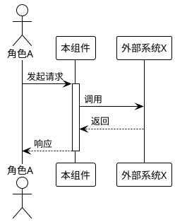

# [AR编号] Spec 增量设计

> 本文档描述对 SPEC.md 的增量变更，使用 ADDED/MODIFIED/REMOVED 标记。
> 完成后需合并到全量 SPEC.md 中。

---

## ADDED Requirements

> 新增的业务规则和能力

### 5.X [新功能模块名称]

#### 5.X.1 业务规则

1. **规则名称**：[详细描述，使用"必须/禁止/应当"]
   - **验收条件**：[触发场景] → [预期行为]
   - **验收条件**：[触发场景] → [预期行为]

2. **规则名称**：[详细描述]
   - **验收条件**：[触发场景] → [预期行为]

3. **禁止项**：[详细描述]
   - **验收条件**：[触发场景] → [预期行为]

#### 5.X.2 交互流程

#### 5.X.3 异常场景

1. **场景：[异常场景名称]**
   - **触发条件**：[描述]
   - **系统行为**：[描述]
   - **用户感知**：[错误码或提示]

---

## MODIFIED Requirements

> 修改的现有业务规则（需写出完整修改后的内容）

### 5.Y [现有功能模块名称]

#### 5.Y.1 业务规则

1. **规则名称**：[修改后的完整描述]  ← (原为: [原描述])
   - **验收条件**：[触发场景] → [新预期行为]

---

## REMOVED Requirements

> 删除的业务规则

### 5.Z [要删除的功能模块名称]

**删除原因**：[说明为什么删除此功能]

**迁移路径**：[如适用，说明用户如何适应此删除]

---

## 数据约束变更

### ADDED

#### 6.X [新领域对象]

1. **字段1**：[约束描述]
2. **字段2**：[约束描述]

### MODIFIED

#### 6.Y [现有领域对象]

1. **字段1**：[修改后约束]  ← (原为: [原约束])

---

## 术语变更

### ADDED

**新术语名称**
: [术语定义]

### MODIFIED

**现有术语名称**
: [修改后定义]  ← (原为: [原定义])

---

## 合并检查清单

- [ ] ADDED 内容已添加到对应章节
- [ ] MODIFIED 内容已替换原有内容
- [ ] REMOVED 内容已从 SPEC.md 中删除
- [ ] 章节编号已重新整理
- [ ] PlantUML 图表可正常渲染

## 约束
- 规格要可验证、无歧义
- 每条规格必须有明确的验收标准
- 引用 SPEC.md 时要标注具体章节
- 不涉及技术实现细节（那是设计阶段的事）
